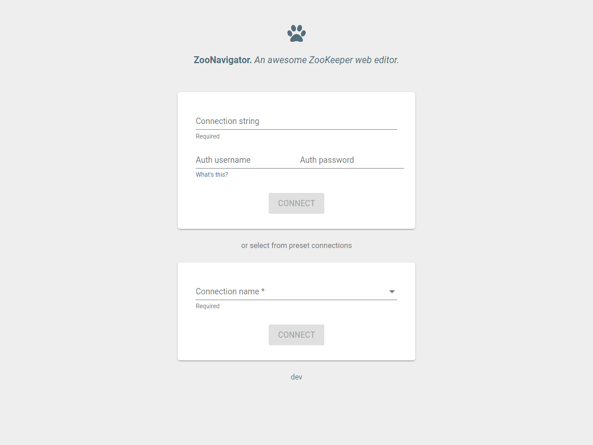
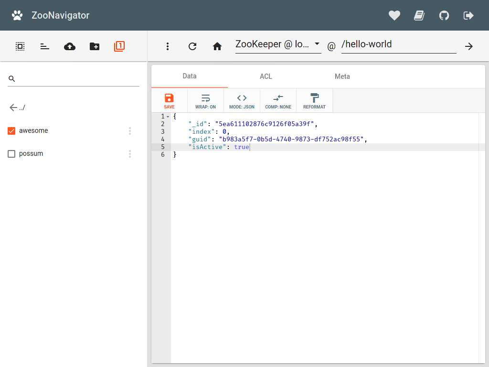
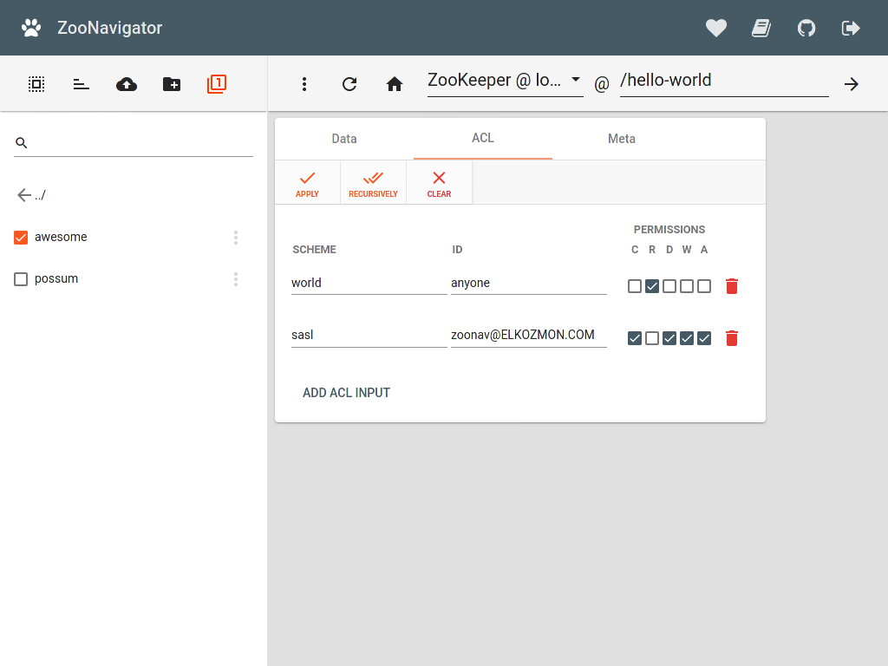
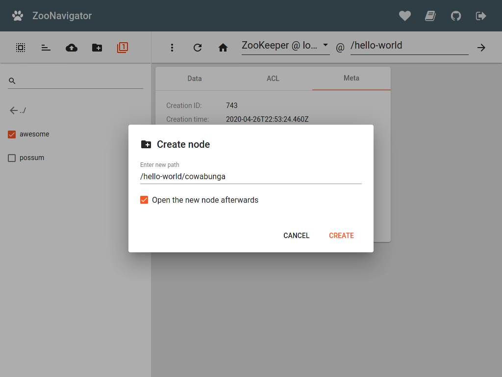
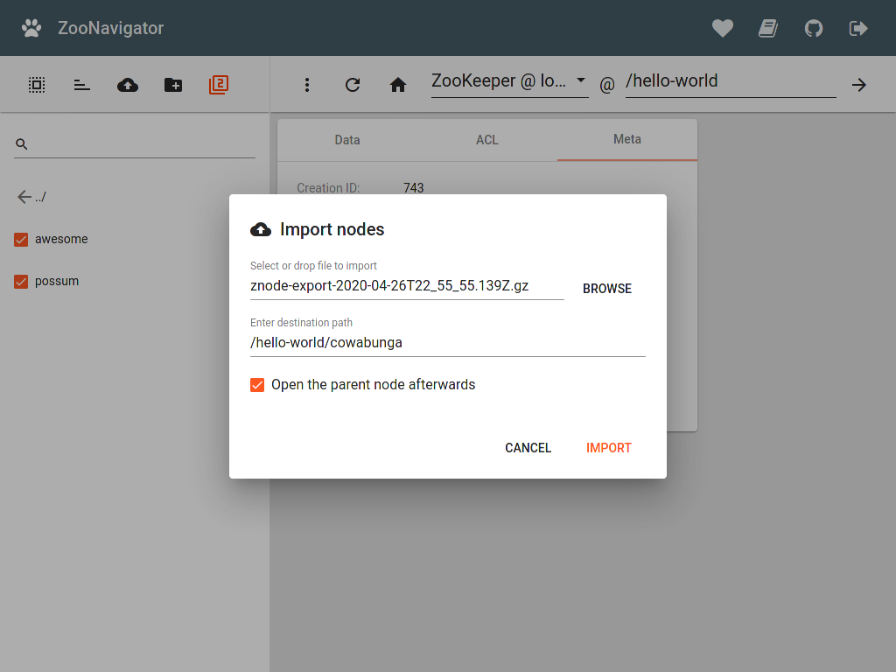
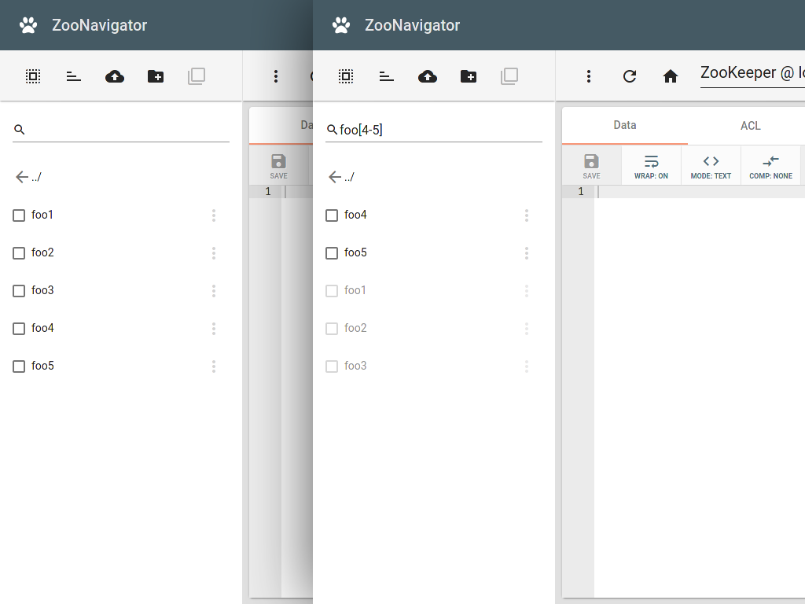

==============
ZooNavigator
==============

ZooNavigator is a **feature-rich web interface for ZooKeeper**.

The source code is licensed under AGPLv3 and is available on `GitHub <https://github.com/elkozmon/zoonavigator>`_.

If you like this project, please, consider supporting me `by buying me a beer <https://www.paypal.me/elkozmon>`_, thanks! 🍺❤️

Screenshots
===========

.. list-table::
   :widths: auto
   :class: zoo-screenshots

   * - |img1|
     - |img2|
     - |img3|
   * - |img4|
     - |img5|
     - |img6|

.. toctree::
   :maxdepth: 2
   :caption: Contents

   quickstart
   features
   docker/index
   snap/index
   development
   faqs
   changelog
