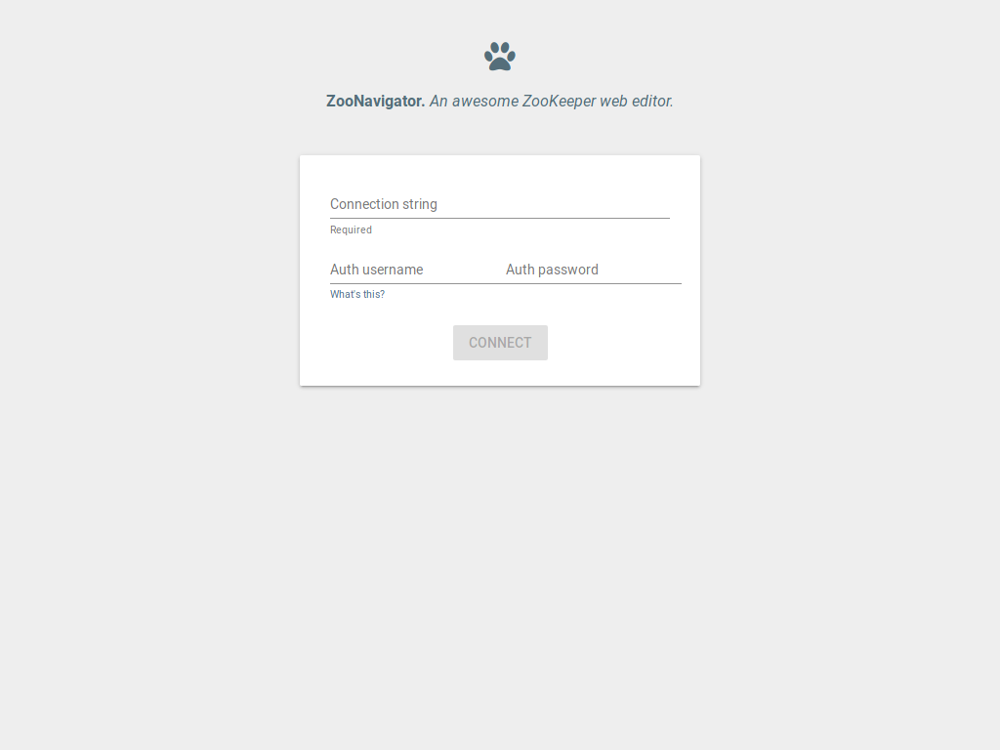
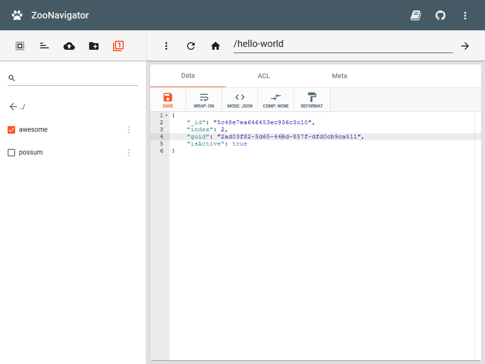
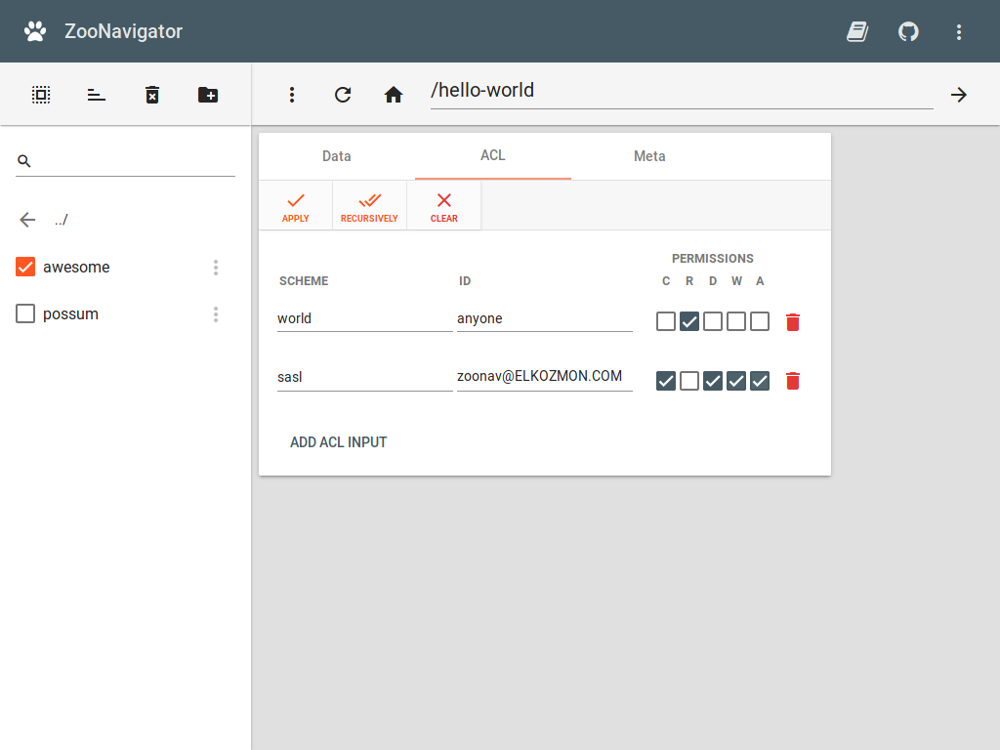
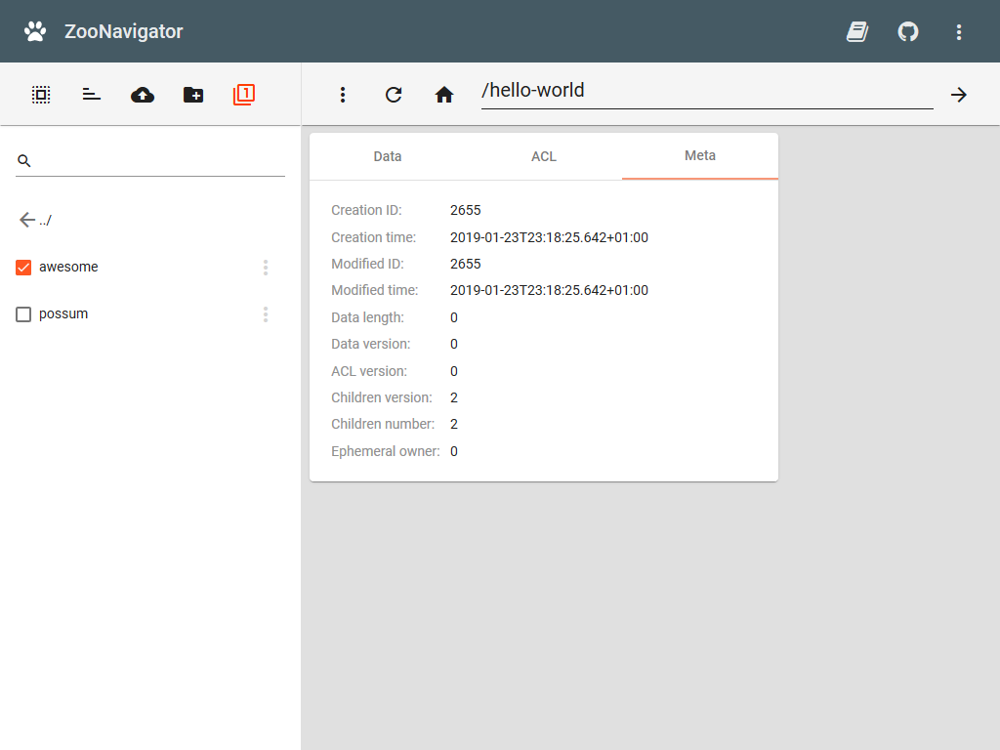
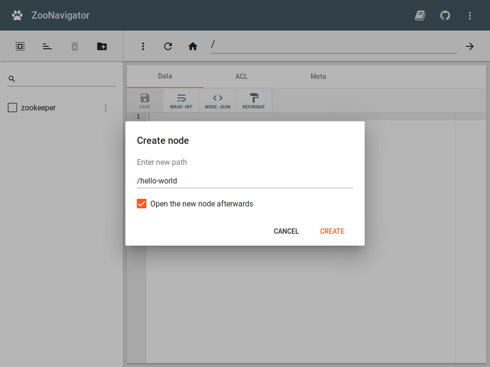
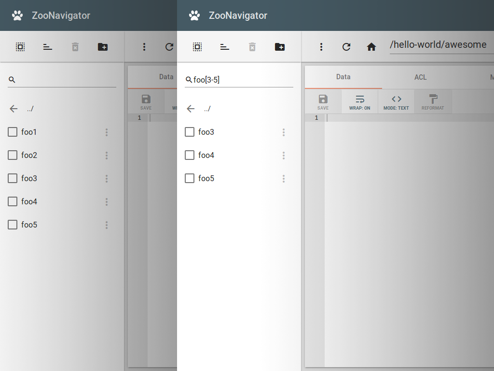

ZooNavigator is a **web-based browser & editor for ZooKeeper** with many features.

It is an open source project and the source code is available on [GitHub](https://github.com/elkozmon).

  

  

  

  

  

  

### Credits

This project is written in [Play Framework](https://github.com/playframework/playframework) and [Angular Framework](https://github.com/angular/angular).

Web client UI is powered by [Teradata Covalent Platform](https://github.com/Teradata/covalent) and [Font Awesome](https://fontawesome.com/license).

### License

The project is licensed under Affero General Public License version 3.0 (AGPLv3).
